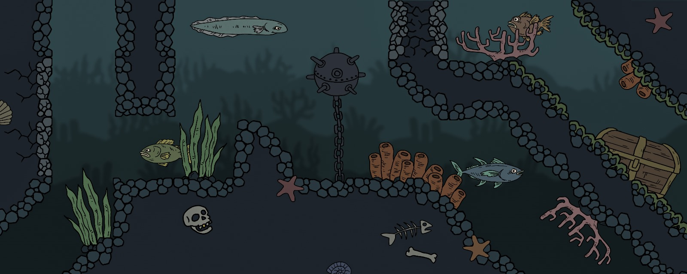

# Nautilus
2D Team-based Free-For-All Extraction Shooter set in the Depths of the Pacific Ocean

Feel free to look into the development process by checking out my [Development Blog](https://cgdprogressblog.blogspot.com)

Find the built Project under: Project Damp\Builds\Nautilus_FinalBuild

# Controls
## Diver Controls
* Movement: A & D
* Climb Ladder: Space
* Operate Station: F
* Use Item in Inventory: Space
* Remove Item From Inventory: E

## Submarine Controls
* Movement: WASD
* Rotation: Q & E

## Turret Controls
* Rotation: Q & E
* Shoot: W

## Victory Conditions
* Search through the map for the Extraction Beacon. (Pirate Coin)
* Bring it to the Teleport Zone. (Top of the Map)
* Use it when in the teleport zone to extract!
